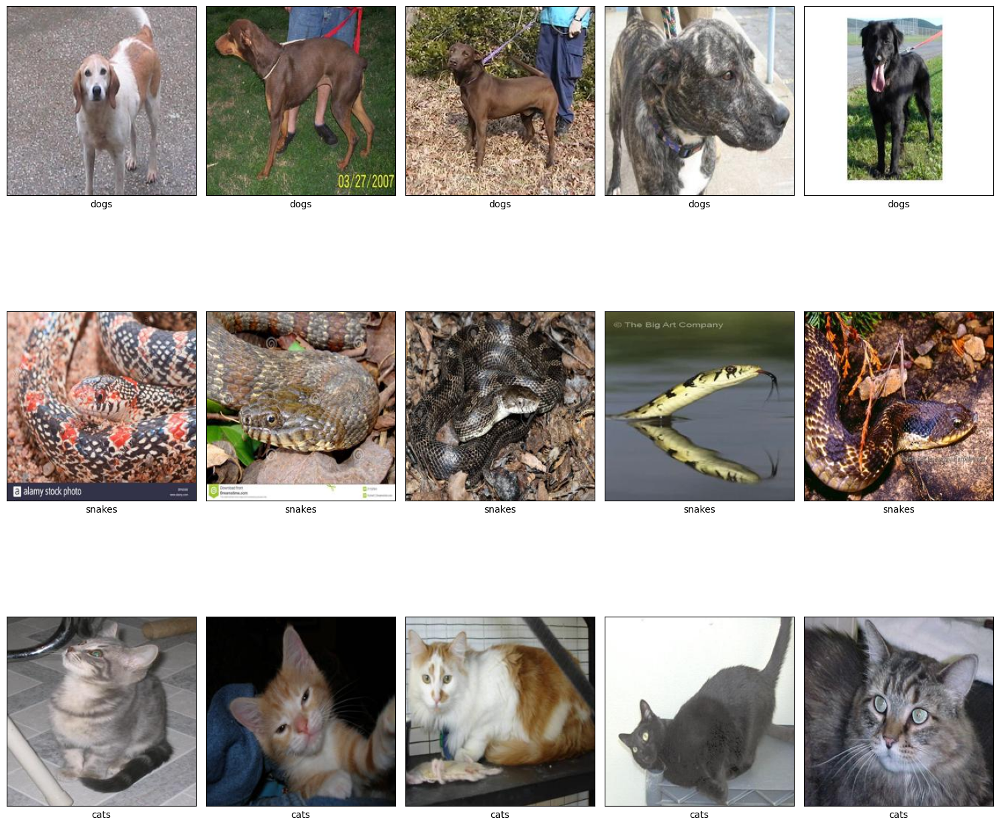
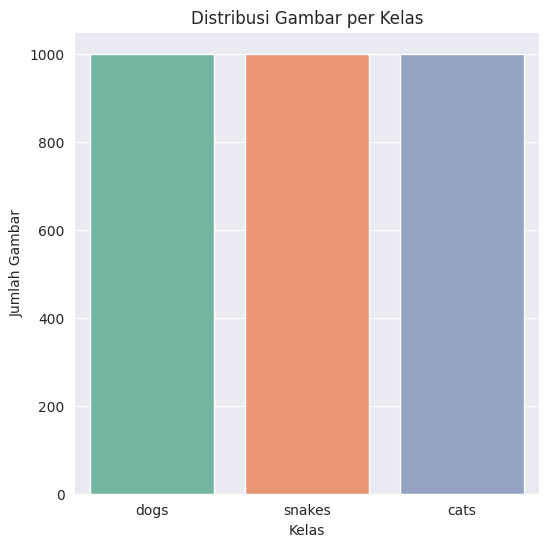
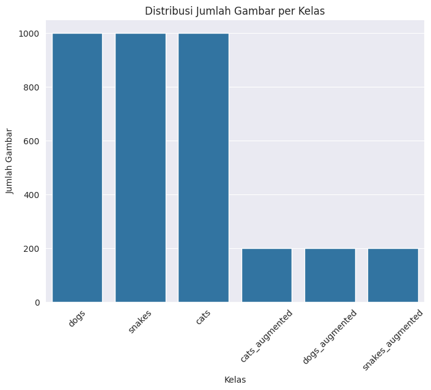
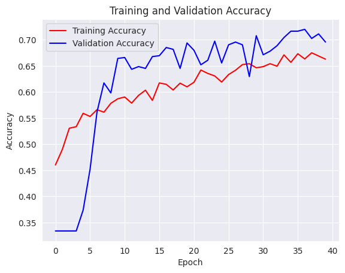
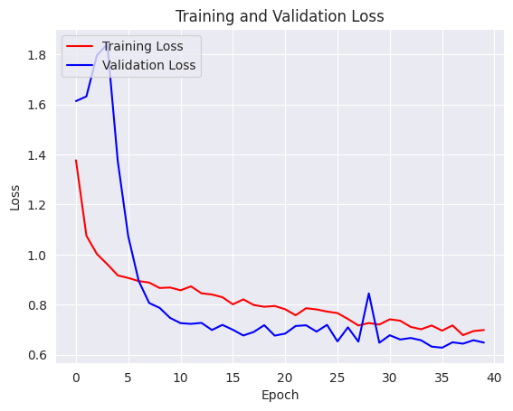
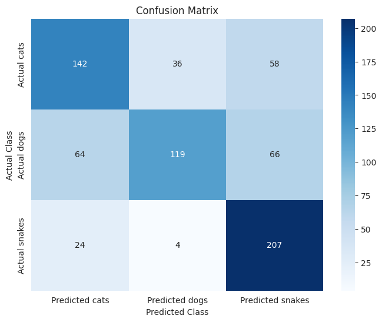
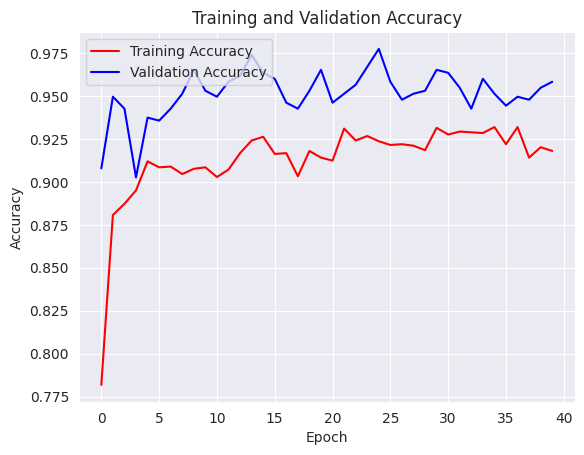
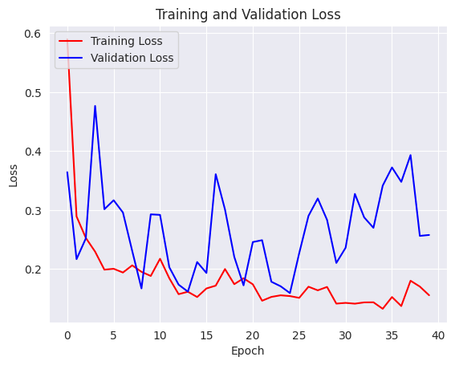
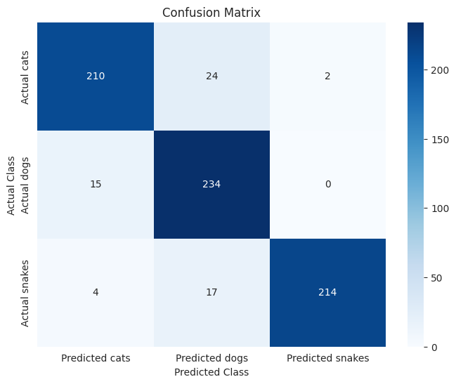

# Laporan Klasifikasi Gambar Hewan - Vittorio Fiorentino

---

## Domain Proyek

Klasifikasi gambar merupakan salah satu aplikasi penting dalam bidang visi komputer, di mana sistem mampu mengenali dan mengelompokkan objek dari gambar secara otomatis. Dalam dunia nyata, kemampuan untuk membedakan jenis hewan seperti anjing (dog), kucing (cat), dan ular (snake) bisa sangat berguna, misalnya untuk aplikasi keamanan, pemantauan hewan liar, atau sistem pencarian otomatis berbasis gambar.

Dengan kemajuan teknologi deep learning, terutama penggunaan Convolutional Neural Networks (CNN), performa klasifikasi gambar telah meningkat secara signifikan. CNN mampu mengekstraksi fitur visual kompleks secara otomatis tanpa perlu ekstraksi fitur manual seperti pada metode tradisional. Model-model ini telah terbukti efektif dalam tugas-tugas klasifikasi gambar, termasuk pengenalan hewan.

---

## Business Understanding

### Problem Statements
Bagaimana membangun model klasifikasi gambar untuk membedakan antara anjing, kucing, dan ular?

Algoritma deep learning mana yang memberikan performa terbaik dalam klasifikasi gambar hewan ini?

### Goals
Mengembangkan model klasifikasi gambar yang mampu mengenali jenis hewan dari gambar input (dog, cat, snake).

Membandingkan performa beberapa arsitektur deep learning seperti Conv2D dan transfer learning.

### Solution Statement

Untuk menyelesaikan permasalahan klasifikasi gambar hewan ini, digunakan dua pendekatan berbasis deep learning, yaitu:

Model CNN dengan Conv2D:
Model dibuat dari awal menggunakan layer Conv2D, MaxPooling, Flatten, dan Dense. Pendekatan ini memungkinkan pemahaman mendalam terhadap proses training dan ekstraksi fitur dari gambar. Model ini akan dilatih dengan data gambar anjing, kucing, dan ular untuk mengenali pola visual khas dari masing-masing kelas.

Transfer Learning:
Menggunakan arsitektur pretrained seperti MobileNetV2 atau ResNet50, model memanfaatkan bobot hasil pelatihan pada dataset besar (misalnya ImageNet) untuk mengekstraksi fitur. Layer atas (fully connected) disesuaikan dengan klasifikasi 3 kelas (dog, cat, snake). Transfer learning mempercepat pelatihan dan meningkatkan akurasi, terutama saat data training terbatas.

Evaluasi kedua model dilakukan menggunakan akurasi, precision, recall, dan F1-score pada data pengujian, untuk mengetahui pendekatan mana yang paling efektif dalam mengklasifikasikan gambar hewan.

---

## Data Understanding
Dataset diperoleh dari kaggle dan langsung diimport: animal-image-classification-dataset.zip
Dataset yang digunakan merupakan data gambar hewan: dogs, cats, snakes dengan atribut:
- Jumlah gambar dogs = 1000 gambar
- Jumlah gambar cats = 1000 gambar
- Jumlah gambar snakes = 1000 gambar

**Plot Distribusi Untuk Semua Kelas**

---

### Exploratory Data Analysis (EDA)

#### Data Augmentasi

transformations = {
    'rotate anticlockwise': anticlockwise_rotation,
    'rotate clockwise': clockwise_rotation,
    'warp shift': warp_shift,
    'blurring image': blur_image,
    'add brightness': add_brightness,
    'flip up down': flip_up_down,
    'shear image': sheared

- Proses augmentasi berguna untuk memproses gambar agar memudahkan dalam proses analisa

Lalu kita akan memisahkan data asli dengan data yang telah di augmentasi

---

## Data Preparation

**Splitting Data: Train dan Test**

**Pembagian data training dan test adalah 80:20**

Distribusi data:
labels
cats                1000
cats_augmented       200
dogs                1000
dogs_augmented       200
snakes              1000
snakes_augmented     200
dtype: int64
Train size: 2880
Test size: 720

**Setelah itu kita akan menggabungkan dataframe sehingga menjadi seperti ini**

set    labels          
test   cats                188
       cats_augmented       48
       dogs                212
       dogs_augmented       37
       snakes              189
       snakes_augmented     46
train  cats                812
       cats_augmented      152
       dogs                788
       dogs_augmented      163
       snakes              811
       snakes_augmented    154

---

### Image Data Generator

**Membuat path untuk masing-masing kelas:**

train_dogs = os.path.join(TRAIN_DIR, 'dogs')
train_cats = os.path.join(TRAIN_DIR, 'cats')
train_snakes = os.path.join(TRAIN_DIR, 'snakes')

test_dogs = os.path.join(TEST_DIR, 'dogs')
test_cats = os.path.join(TEST_DIR, 'cats')
test_snakes = os.path.join(TEST_DIR, 'snakes')

Output:

Total number of dog images in training set:  951
Total number of cat images in training set:  964
Total number of snake images in training set:  965
Total number of dog images in test set:  249
Total number of cat images in test set:  236
Total number of snake images in test set:  235

**Setelah itu kita akan membuat ImageDataGenerator untuk normalisasi dan split validasi dari training set:**

Found 2305 images belonging to 3 classes.
Found 575 images belonging to 3 classes.
Found 720 images belonging to 3 classes.

---

## Modeling

Dua model machine learning yang digunakan:
- **Conv2D**

Dikarenakan uji coba modelling Conv2D, cukup rendah dengan nilai accuracy sekitar 0.6842, maka kita akan menggunakan transfer learning untuk meningkatkan nilai accuracy.
accuracy: 0.6574 - loss: 0.6931 - val_accuracy: 0.6957 - val_loss: 0.6488

- **Transfer Learning**

Dari uji coba modelling Transfer Learning, terlihat nilai accuracy meningkat sampai 0,9121.
accuracy: 0.9121 - loss: 0.1624 - val_accuracy: 0.9583 - val_loss: 0.2578

---

## Evaluation

### Metrik Evaluasi

**Conv2D**

Visual Accuracy

Visual Loss

Visual Correlation Matrix

Classification Report:

              precision    recall  f1-score   support

        cats     0.6174    0.6017    0.6094       236
        dogs     0.7484    0.4779    0.5833       249
      snakes     0.6254    0.8809    0.7314       235

    accuracy                         0.6500       720
   macro avg     0.6637    0.6535    0.6414       720
weighted avg     0.6653    0.6500    0.6402       720

---
**Transfer Learning**

Visual Accuracy

Visual Loss

Visual Correlation Matrix

Classification Report:

              precision    recall  f1-score   support

        cats     0.9170    0.8898    0.9032       236
        dogs     0.8509    0.9398    0.8931       249
      snakes     0.9907    0.9106    0.9490       235

    accuracy                         0.9139       720
   macro avg     0.9196    0.9134    0.9151       720
weighted avg     0.9182    0.9139    0.9147       720

---

### Hasil Pengujian Data

Evaluasi Akurasi Prediksi:

Dengan modelling Conv2D awalnya mendapat accuracy yang cukup rendah, tetapi saat menggunakan pendekatan transfer learning, nilai accuracy meningkat menjadi 0.9121

- Conv2D

accuracy: 0.6574 - loss: 0.6931 - val_accuracy: 0.6957 - val_loss: 0.6488

- Transfer Learning

accuracy: 0.9121 - loss: 0.1624 - val_accuracy: 0.9583 - val_loss: 0.2578

---

### Konversi Model

- Format SavedModel
- Format TFJS
- Format TF-Lite

Kemudian hasil konversi akan disimpan ke dalam folder files.download('koko_model_all.zip')

---

### Inference

Hasil inference diuji menggunakan website

